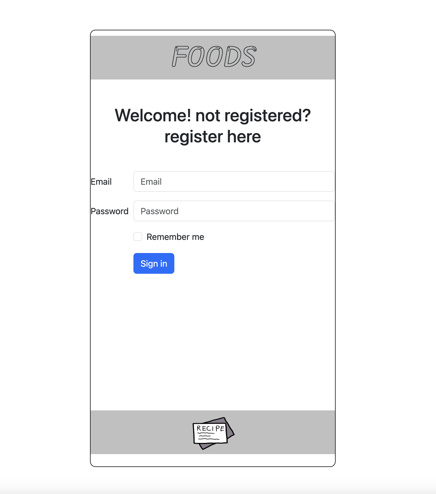
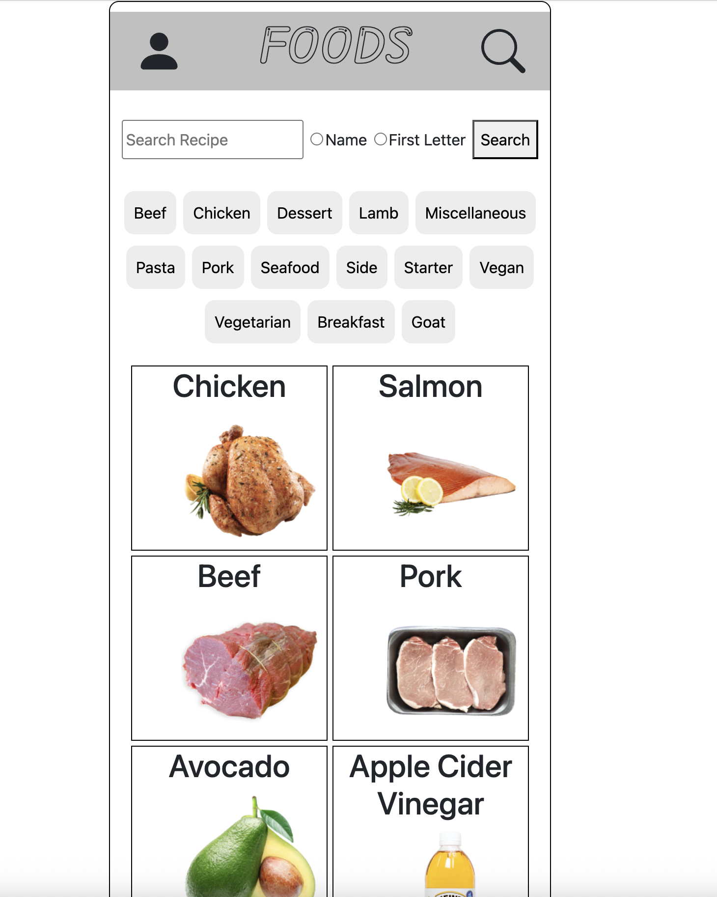
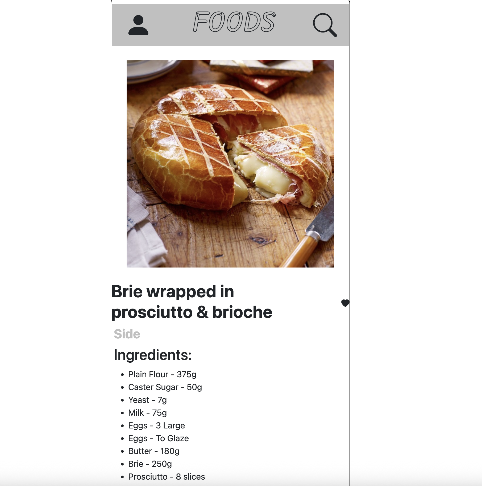
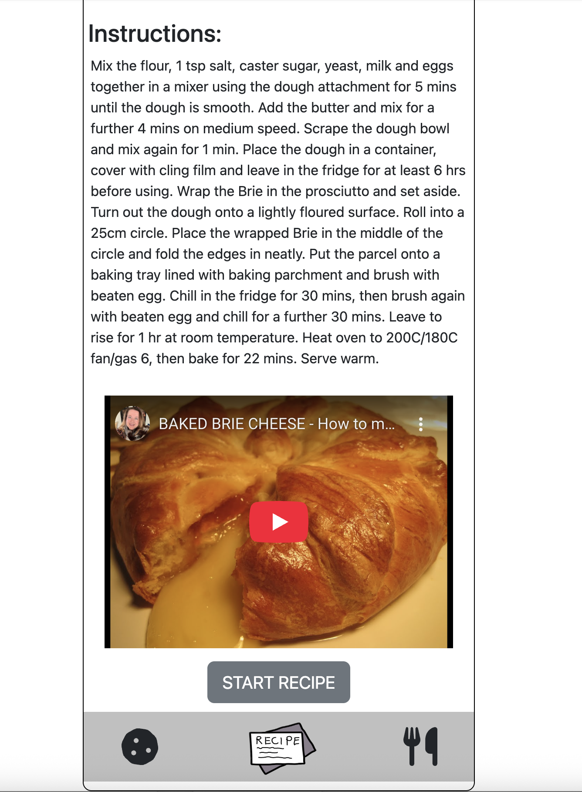
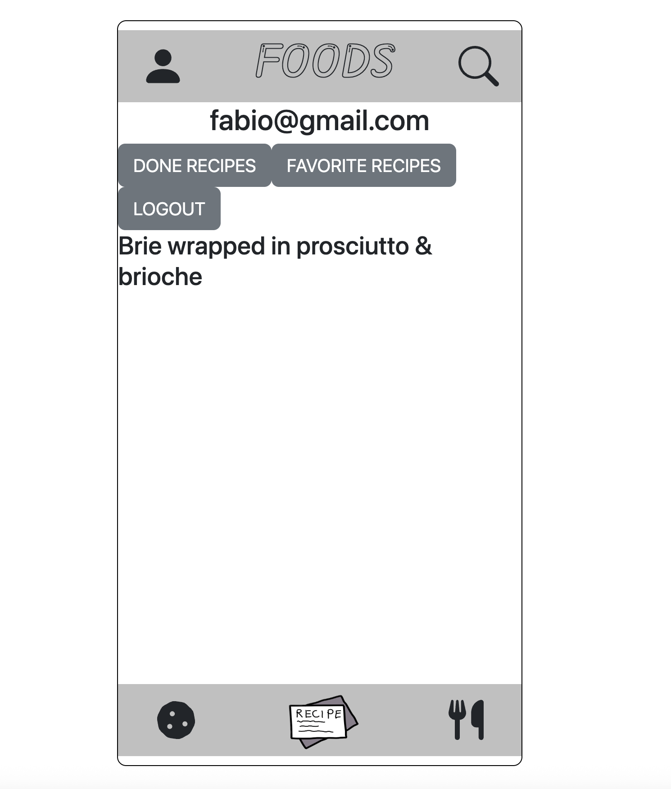

# API-PROJECT-FOOD

## Description

API Food is a project for those who love to innovate in the kitchen. With a wide variety of recipes, you can choose your favorite type — from Thai food to French cuisine(any cuisine). Be the chef and bring joy to your family’s table!

## Usage

Register your own account, browse through the available recipes from the API, save your favorites for later, or start preparing them right away.

## Technologies used

CSS, React.Js. API end Point https://www.themealdb.com/api/json/v1/1/list.php?i=list

## Credits

Project By Fabio Silveira.

## Deployed Site

[Live Demo Link]()

